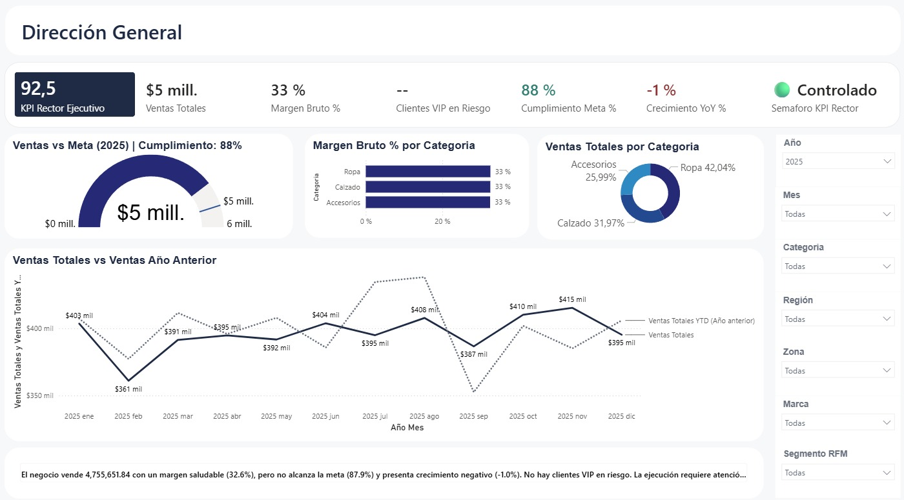
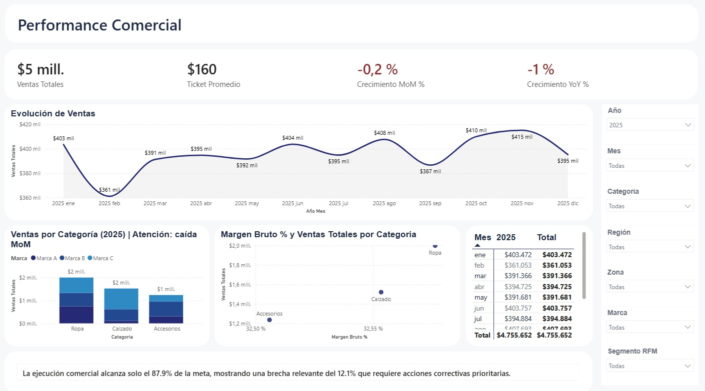
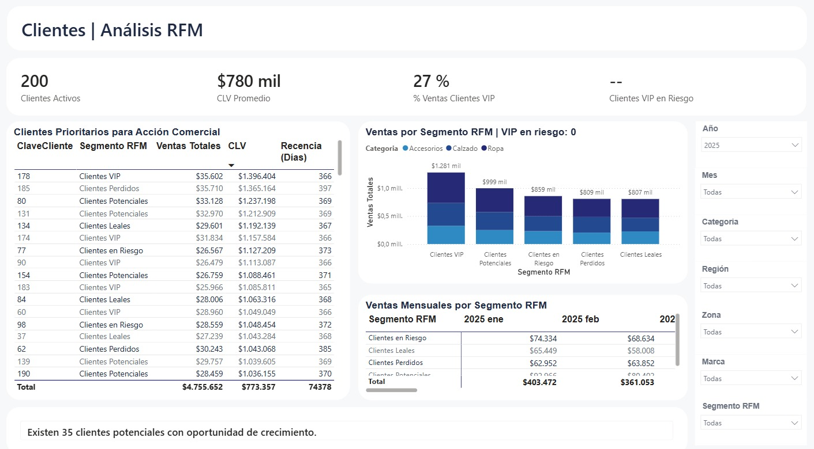
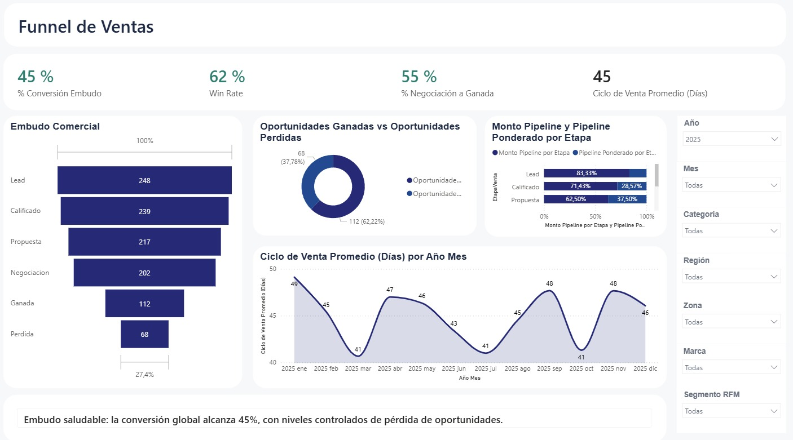
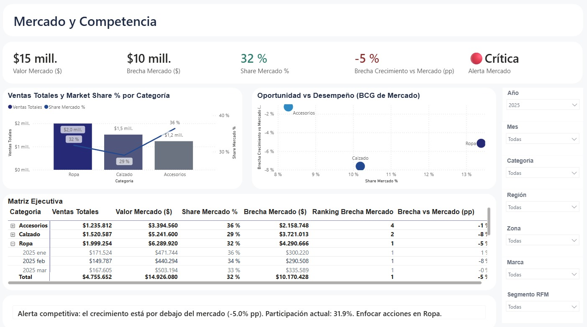
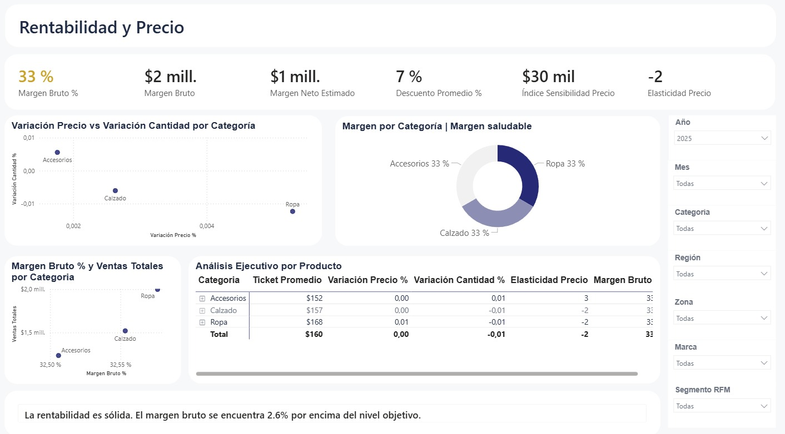
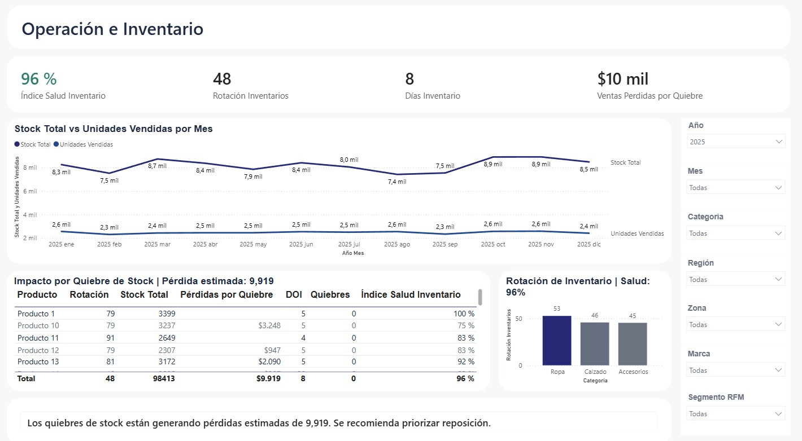
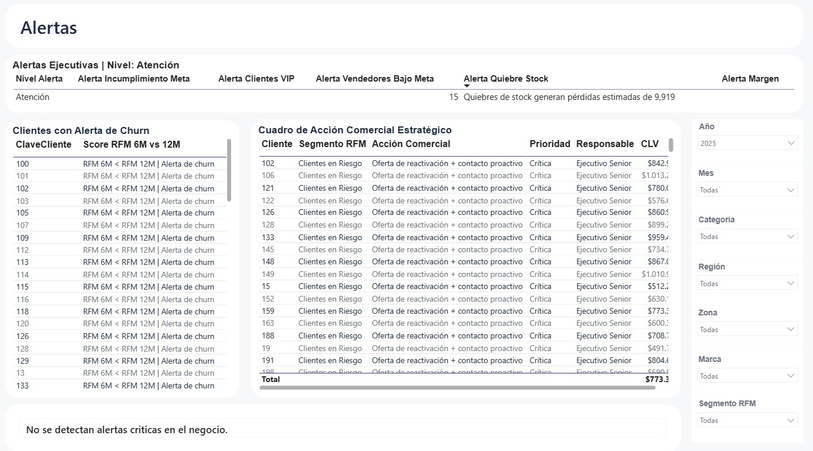

# Dashboard Ejecutivo para Dirección 360° | Power BI

> **Más que un reporte: una herramienta para decidir mejor.**

---

## 📌 Contexto del problema

En la mayoría de organizaciones, la información comercial está fragmentada. Ventas, clientes, forecast, rentabilidad, inventarios y mercado operan en silos: cada área analiza sus propios KPIs, pero Dirección termina recibiendo múltiples reportes aislados que muestran **qué pasó**, sin explicar dónde actuar, qué está en riesgo o qué decisiones priorizar.

Este proyecto nació de esa observación: las empresas tienen muchos reportes, pero pocas herramientas reales para decidir.

---

## 🎯 Objetivo

Transformar datos operativos en señales ejecutivas claras — centralizando estrategia, operación y acción comercial dentro de un solo modelo analítico orientado a Dirección.

---

## 🗂️ Estructura del dashboard

El modelo integra **10 páginas analíticas** conectadas bajo una lógica ejecutiva única:

| Página | Propósito |
|--------|-----------|
| **Dirección General** | KPIs rectores, semáforo ejecutivo e insight automático del negocio |
| **Performance Comercial** | Desempeño de ventas por canal, categoría, marca y región |
| **Forecast** | Proyección de cierre, brechas vs meta y ritmo de ejecución |
| **Funnel Comercial** | Conversión por etapa y productividad de la fuerza de ventas |
| **Clientes RFM** | Segmentación por Recencia, Frecuencia y Monto — riesgo de fuga |
| **Rentabilidad y Precio** | Margen por categoría, productividad comercial y análisis de pricing |
| **Operación e Inventarios** | Salud operativa, cobertura de stock y rotación de inventario |
| **Mercado y Competencia** | Posición competitiva, participación de mercado y benchmarking |
| **Alertas de Ejecución** | Semáforos de riesgo, desviaciones críticas y prioridades de acción |
| **Vista Ejecutiva Clientes RFM** | Resumen estratégico de la base de clientes para dirección |

---

## 📸 Vistas del dashboard

### Dirección General

### Performance Comercial

### Análisis RFM de Clientes

### Funnel de Ventas

### Mercado y Competencia

### Rentabilidad y Precio

### Operación e Inventario

### Alertas de Ejecución

---

## 🔍 Diferencial analítico

El dashboard no se limita a describir resultados — explica contexto, riesgo y prioridad de acción:

- **Brecha de meta:** cuánto falta para cerrar el objetivo y cuántos clientes u oportunidades se necesitan para cubrirlo
- **Pérdida de ritmo:** detección de desaceleración frente al mercado antes de que impacte el resultado final
- **Riesgo de fuga:** identificación de clientes VIP en riesgo mediante segmentación RFM automatizada
- **Priorización comercial:** categorías ordenadas por impacto económico y desempeño competitivo
- **Narrativa automática:** cada página genera un insight ejecutivo en lenguaje natural orientado a decisión

---

## ⚙️ Stack tecnológico

| Herramienta | Uso |
|-------------|-----|
| **Power BI Desktop** | Desarrollo del modelo y visualizaciones |
| **DAX** | Medidas avanzadas, métricas compuestas y lógica de semaforización |
| **Power Query (M)** | ETL: limpieza, transformación e integración de fuentes |
| **Modelado dimensional** | Esquema estrella para rendimiento analítico óptimo |
| **CSV** | Fuente de datos simulada con escenarios de negocio reales |

---

## 💡 Valor para el negocio

| Beneficio | Impacto |
|-----------|---------|
| Centralización de información crítica | Una sola vista para toda la dirección comercial |
| Aceleración de decisiones | De horas de análisis manual a segundos de lectura ejecutiva |
| Visibilidad de riesgos | Alertas tempranas antes de que los problemas escalen |
| Priorización comercial | Foco en lo que más impacta el resultado del negocio |
| Reducción de reportes dispersos | Un modelo reemplaza múltiples informes aislados |

---

## 👤 Autor

**Fabian Quispe Castillo**  
Analista de Business Intelligence | Lima, Perú

---

> *Este proyecto representa una propuesta de Business Intelligence orientada a gestión y dirección comercial. Su propósito no es mostrar más métricas — sino ayudar a decidir mejor.*
